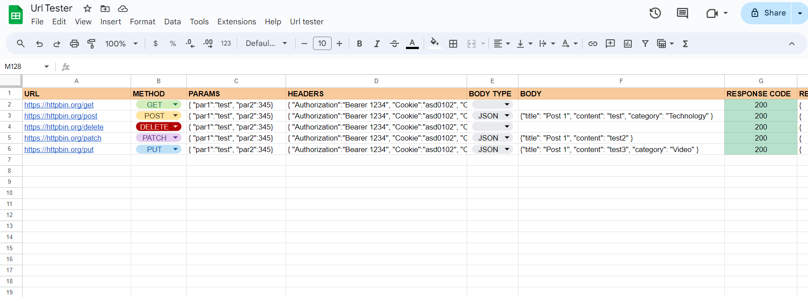

# Spreadsheet-Url-Tester
A Google Spreadsheet to send HTTP request (GET, POST, DELETE, PATCH, PUT) to multiple URLs with the possibility of specify params, headers and body in the call.

## Usage

There are 2 sheet:
- Data
- Settings

### Data sheet

- Column A: url
- Column B: HTTP request method (Supported HTTP request methods: GET, POST, DELETE, PATCH, PUT)
- Column C: params in JSON format

     Example:
     URL: https://mywebsite.com
     PARAMS: {"param1":"test", "params2":"test2"}
     FETCHED URL: https://mywebsite.com?param1=test&param2=test2
  
- Column D: headers in JSON format
- Column E: Body Type that can be JSON or TEXT
- Column F: body in JSON/PLAIN TEXT format
- Column G: Response Code returned by the request
- Column H: Response body returned by the request
  

### Settings sheet

You can edit the settings of the http requests:

- validateHttpsCertificates: TRUE/FALSE --> If FALSE the fetch ignores any invalid certificates for HTTPS requests
- followRedirects: TRUE/FALSE --> If FALSE the fetch doesn't automatically follow HTTP redirects; it returns the original HTTP response

To run the script you can use the toolbar options "Url Tester". The first time when you run the script it will ask to grant permissions.
